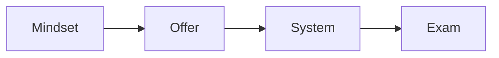

# Certification

This program sets the standards for a certified team. It shows how to audit a
business and build a working system for someone else.

## Who it helps

You want to serve clients as a certified operator. You want a proven process
you can trust.

## What you will learn

- Hold a calm, expert mindset.
- Price on the outcome, not the hours.
- Build an offer for any business.
- Build the product and the funnel.
- Set up a sales system for a client.
- Pass an exam that proves the skill.

Certification proves you can do the work.

## Start the program

[Open the certification deck](certification.html){target="_blank"}

## Where to go next

- [Certification playbook](../ops/playbooks/certification.md): run the program.
- [Certification exam SOP](../ops/sops/certification-exam.md): run the exam.
- [Call audit SOP](../ops/sops/call-audit.md): review a recorded call.
