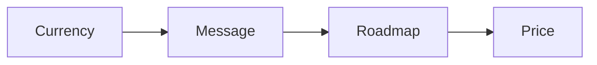

# High ticket course launch

This is a shorter path to a first premium product. It skips the long production
days and keeps the core steps.

## Who it helps

You are new to the method. You want the main steps without the full 14-day
schedule.

## What you will learn

- Choose a currency and a customer.
- Write one message that lands.
- Dump your knowledge into a roadmap.
- Shape the course outline.
- Fill the content crushers.
- Set a price and use a slide template.

The core steps stay the same at every depth.

## Start the program

[Open the high ticket course launch deck](high-ticket-course-launch.html){target="_blank"}

## Where to go next

- [Product roadmap](../method/product-roadmap.md): shape three stages.
- [Money message](../method/money-message.md): write one message.
- [Brain dump to roadmap SOP](../ops/sops/brain-dump-to-roadmap.md): sort the idea.
