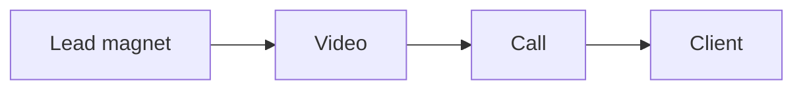

# High ticket funnels

This program goes deep on the machine that turns a stranger into a paying
client. It covers lead magnets, calls, community, and closing.

## Who it helps

You have a product or a plan for one. You need a repeatable way to get
appointments and close them.

## What you will learn

- Pick the hottest step of your product as a lead magnet.
- Build a simple page and video that fill a calendar.
- Run a community that warms up leads.
- Use a short script to enroll clients.
- Track the few numbers that show what works.

The funnel has one job at each step.

## Start the program

[Open the high ticket funnels deck](high-ticket-funnels.html){target="_blank"}

## Where to go next

- [Lead magnet playbook](../ops/playbooks/lead-magnet.md): build the free step.
- [Funnel playbook](../ops/playbooks/funnel.md): build the short funnel.
- [Enroll playbook](../ops/playbooks/enroll.md): run the enrollment call.
