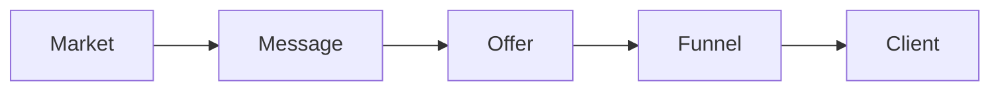

# High ticket launch accelerator

This is the full RED Method path. You take what you know and turn it into a
product you can sell and deliver. The path runs about 12 weeks.

## Who it helps

You are a coach, consultant, or agency owner. You want to stop trading time for
money. You want a premium product that keeps working for you.

## What you will learn

- Pick one market and one clear problem.
- Write one message that states the result, the time, and the payoff.
- Shape your knowledge into a product roadmap.
- Set a premium price and defend it.
- Build a simple funnel that books calls.
- Turn a call into a paying client without pressure.

The path moves in one direction, from offer to client.

## Start the program

[Open the high ticket launch accelerator deck](high-ticket-launch-accelerator.html){target="_blank"}

## Where to go next

- [The method map](../method/motions.md): three phases, nine motions, 27 steps.
- [Offer playbook](../ops/playbooks/offer.md): set the offer and the price.
- [Enroll playbook](../ops/playbooks/enroll.md): run the enrollment call.
