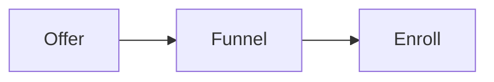

# Learning programs

These programs teach the RED Method step by step. Each program has a written
summary and a slide deck. Open a deck to study the ideas in a slide show. The
deck opens in a new tab so you can keep this page open.

Each deck is built for phones, tablets, and desktop screens. The text stays
readable on a small screen.

## Pick a program

| Program | What it covers |
|---|---|
| [High ticket launch accelerator](high-ticket-launch-accelerator.md) | The full 12-week path from idea to enrolled client. |
| [High ticket funnels](high-ticket-funnels.md) | Lead magnets, calls, community, and closing. |
| [14-day course launch](14-day-course-launch.md) | Build and launch a course in 14 days. |
| [Winning webinar](winning-webinar.md) | Plan, build, and run a webinar that converts. |
| [Youtube content](youtube-content.md) | Ads, copy, video, and the numbers behind them. |
| [Live sessions](live-sessions.md) | Offer building, hooks, pricing, and scaling. |
| [High ticket course launch](high-ticket-course-launch.md) | A shorter path to a first premium product. |
| [Perfect offer](perfect-offer.md) | Currency, message, and the product roadmap. |
| [Certification](certification.md) | Standards and practice for a certified team. |

The programs share one method. They differ in depth and focus.

## How to use a program

1. Read the summary to see who it helps and what you will learn.
2. Open the deck and move through the slides.
3. Do the short task on each practice slide.
4. Use the linked playbooks when you run the work for real.

## Where this fits

The programs teach the same method as [the method map](../method/motions.md).
When you are ready to run the work, use the [operations manual](../ops/index.md).

Start with [the big idea](../method/big-idea.md) if the method is new to you.
