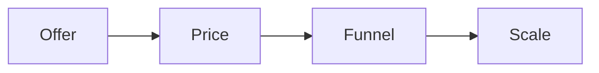

# Live sessions

This program holds live and recorded sessions on offer building, hooks,
pricing, and scaling a high ticket business.

## Who it helps

You are mid-build. You want worked examples and answers to real questions.

## What you will learn

- Build a one-page offer.
- Make many hooks and headlines.
- Run a checkpoint that keeps a call on track.
- Price a product and grow its value.
- Choose the right funnel for your price.

You start high and add offers down the line.

## Start the program

[Open the live sessions deck](live-sessions.html){target="_blank"}

## Where to go next

- [Hooks and headlines](../ops/checklists/hooks-headlines.md): make many hooks.
- [Checkpoint card](../ops/checklists/checkpoint-card.md): run the call gates.
- [Strategy session playbook](../ops/playbooks/strategy-session.md): run a paid session.
