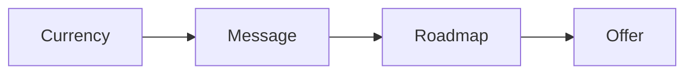

# Perfect offer

This program teaches the base of everything: one currency, one message, and one
product roadmap.

## Who it helps

You have knowledge but no clear offer. You want a product that stands out in a
busy market.

## What you will learn

- Turn a category into one currency.
- Write a message with a metric and a timeline.
- Rank pains and goals to find the one that matters.
- Brain dump your knowledge.
- Shape the product roadmap.
- Test the offer with real people.

A clear offer makes the rest fall into place.

## Start the program

[Open the perfect offer deck](perfect-offer.html){target="_blank"}

## Where to go next

- [Refine Offer](../method/refine-offer.md): the first phase of the method.
- [The money message](../method/money-message.md): write one message.
- [Currency calculator](../ops/checklists/currency-calculator.md): pick the one currency.
