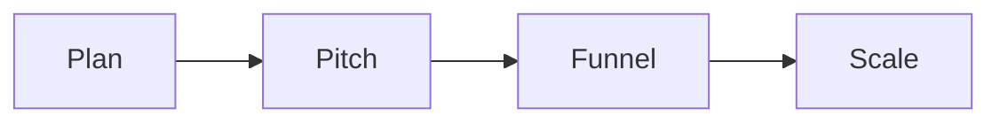

# Winning webinar

This program shows you how to plan, build, and run a webinar that turns one
talk into many sales.

## Who it helps

You sell something from about 500 to a few thousand dollars. You want to sell
one to many instead of one to one.

## What you will learn

- Plan the webinar before you build it.
- Craft a pitch slide by slide.
- Frame the funnel from sign up to follow up.
- Fill every email and ad.
- Measure and scale with real numbers.

The webinar sells while you sleep.

## Start the program

[Open the winning webinar deck](winning-webinar.html){target="_blank"}

## Where to go next

- [Webinar playbook](../ops/playbooks/webinar.md): run the webinar.
- [Email and nurture playbook](../ops/playbooks/email-nurture.md): fill the follow up.
- [Webinar run of show](../ops/checklists/webinar-run-of-show.md): plan the hour.
