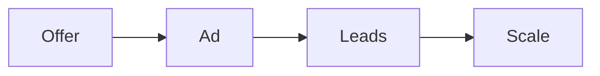

# Youtube content

This program collects the public lessons on paid traffic, copy, video, and the
numbers behind a working campaign.

## Who it helps

You run ads or plan to. You want to fix a weak campaign and know what to change.

## What you will learn

- Make one good ad that people watch.
- Use a simple copy formula for hooks and headlines.
- Fix a campaign with a clear decision tree.
- Track the few metrics that matter.
- Read a campaign and scale it with confidence.

Traffic is one step. The offer must come first.

## Start the program

[Open the youtube content deck](youtube-content.html){target="_blank"}

## Where to go next

- [Traffic playbook](../ops/playbooks/traffic.md): run paid traffic.
- [Ad fix checklist](../ops/checklists/ad-fix.md): fix a weak campaign.
- [Ad campaign setup SOP](../ops/sops/ad-campaign-setup.md): set up a campaign.
