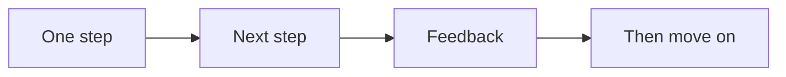
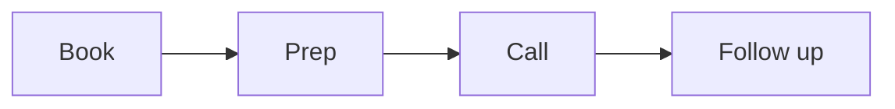

# Cadence

This is an internal operator map. Do not publish it. It covers order and timing.

The canon is strict about order and timing. Do the steps in order. Do not skip.
Do not work ahead.

## Key timing

- The build is 12 weeks.
- The plan is reviewed every 90 days.
- The product runs 6 to 12 weeks, one module per week.
- Pre-sell clients 6 to 8 weeks before the start.
- A new ad campaign is left alone for about 10 days.
- Retargeting uses a 30-day window by default.
- Content is shared every few days.
- Calls are booked within 72 hours.

## Hard rules

- Do not pass the message station until one currency is approved.
- Do not design the offer before the shape is reviewed.
- Do not make slides before the script is right.
- Never make content outside the signature solution.
- Change one ad variable at a time.
- Never invite before the intent gate passes.
- Get a 5 on commitment before you prescribe.
- End the call early when the lead is not a fit.

## New timing from the extra series

The extra series add these timing rules. Add them to the build line and the run
line.

- Book the call within 72 hours. Ideal is 24 to 48 hours. Show rate drops about
  10 to 20% for each day past 72 hours.
- Send a pre-call homework page before the call. It moves the free line and
  filters the lead.
- Run the closing sequence for 3 to 5 days after a webinar.
- Run the nurture sequence for 27 parts. It can extend to 54.
- Automate a webinar only after 10 live runs at 10% or better.
- Review the numbers each week. Change one ad variable at a time.
- Review the client against their roadmap every 90 days.
- Turn a lead magnet around in 10 minutes or less.
- Keep videos between 5 and 30 minutes. The authority video is 8 to 20 minutes.

## New hard rules

- Do not quote a price before the lead agrees in principle to move forward.
- Do not invite before the intent, commitment, value, and confidence gates pass.
- Do not make slides before the script is right.
- Do not launch a second offer until the first one converts.
- Do not discount. Shorten the deliverable or move to a payment plan instead.
- Do not build a lead magnet from scratch. Use a step of the offer.
