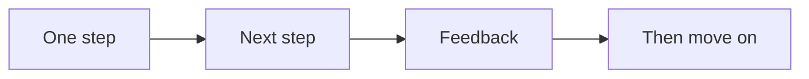

# Cadence

This is an internal operator map. Do not publish it. It covers order and timing.

The canon is strict about order and timing. Do the steps in order. Do not skip.
Do not work ahead.

## Key timing

- The build is 12 weeks.
- The plan is reviewed every 90 days.
- The product runs 6 to 12 weeks, one module per week.
- Pre-sell clients 6 to 8 weeks before the start.
- A new ad campaign is left alone for about 10 days.
- Retargeting uses a 30-day window by default.
- Content is shared every few days.
- Calls are booked within 72 hours.

## Hard rules

- Do not pass the message station until one currency is approved.
- Do not design the offer before the shape is reviewed.
- Do not make slides before the script is right.
- Never make content outside the signature solution.
- Change one ad variable at a time.
- Never invite before the intent gate passes.
- Get a 5 on commitment before you prescribe.
- End the call early when the lead is not a fit.
