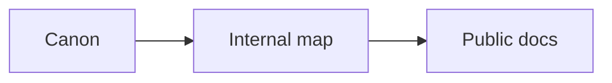
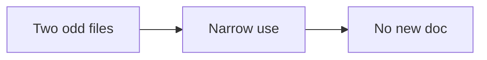

# Canon to docs map

This is an internal operator map. Do not publish it. It traces every useful idea
in the expanded canon to the public doc that carries it.

Use it when you expand a public doc. It tells you where the raw teaching lives
and what we already publish. Keep the public docs free of session numbers,
person names, and internal gaps.

## How to read this map

- **Source**: the series and session that teach the idea.
- **Idea**: the reusable framework, template, or number.
- **Public doc**: where we publish the plain version.
- **Status**: built (already published) or open (planned).

The nine extra series repeat the numbered canon and add detail. They do not add
new stations.

The local `High Ticket Launch Accelerator` folder also holds the 48 numbered
files. This map keeps the 12-week program and the three extra accelerator files
as separate program lines.

## The expanded series at a glance

| Series | Files | Main station | Best for |
|---|---|---|---|
| High Ticket Funnels | 19 | Funnel, Enroll | Lead magnets, calls, community, closing |
| 14D HTCLF | 16 | Offer | The 14-step course launch, product build |
| Winning Webinar | 14 | Funnel, Enroll | Webinar anatomy, email, retargeting |
| Youtube Content | 14 | Traffic, Offer | Ads, copy, metrics, video |
| Live Sessions | 11 | Offer, Enroll | Offer builder, hooks, checkpoints, pricing |
| High Ticket Course Launch | 11 | Offer | Copy of the 14-step launch (shorter) |
| Perfect Offer | 11 | Message, Offer | Currency, message, roadmap |
| Certification | 4 | Offer, Delivery | Consultant standards, certification, paid session |
| High Ticket Launch Accelerator | 3 | Plan, Enroll | Sessions 19 and 20, currency feedback |

## Traceability matrix

### Plan and numbers

| Source | Idea | Public doc | Status |
|---|---|---|---|
| 00, 01 | One-page plan, revenue and client goals | `ops/playbooks/plan.md` | built |
| 14D Step 0 | Premium offer defined as $3,000+ | `ops/playbooks/plan.md` | open |
| High Ticket Funnels 01, 08, 10 | Swim lanes and the 1% rule | `ops/playbooks/numbers.md` | open |
| Youtube KPIs | Lifetime value as the master metric | `ops/playbooks/numbers.md` | open |
| Certification Day 3 | Lead value grows with age | `method/numbers.md` | open |
| 14D Step 10, Perfect Offer 5 | Break-even math and lead worth = price / 100 | `ops/playbooks/numbers.md` | open |

### Market and avatar

| Source | Idea | Public doc | Status |
|---|---|---|---|
| 02, 03, 04 | Market sizing and avatar goals grid | `ops/playbooks/market.md` | built |
| 14D Step 2, Perfect Offer 3 | Currency-first, not avatar-first | `ops/playbooks/market.md` | open |
| 14D Step 2 | 360 avatar ecosystem | `ops/checklists/avatar-ecosystem.md` | open |

### Message

| Source | Idea | Public doc | Status |
|---|---|---|---|
| 05, 06 | Currency and message | `ops/playbooks/message.md` | built |
| Perfect Offer 3, Live Sessions 9 | Currency calculator | `ops/checklists/currency-calculator.md` | open |
| Perfect Offer 3, 4, 10 | Hot vs cold currencies, banned words | `method/money-message.md` | open |
| 14D Step 3, Live Sessions 9 | Million Dollar Message formula | `method/money-message.md` | open |
| Live Sessions 9 | Hooks and headlines generator | `ops/checklists/hooks-headlines.md` | open |
| Certification Day 1 | Three C's and message filters | `method/big-idea.md` | open |

### Offer and product

| Source | Idea | Public doc | Status |
|---|---|---|---|
| 07 to 12 | Profit pyramid, signature solution, price | `ops/playbooks/offer.md` | built |
| Perfect Offer 2, 6 | Offer DNA and seven models | `ops/playbooks/offer.md` | open |
| Perfect Offer 7, 8 | Digital brain dump and weakest-link filter | `ops/sops/brain-dump-to-roadmap.md` | open |
| 14D Step 5, Perfect Offer 8 | Rule of threes: 3 stages, 9 steps, 27 actions | `method/product-roadmap.md` | open |
| 14D Step 7 | Content Crusher (one sheet per step) | `ops/checklists/content-crusher.md` | open |
| 14D Step 6 | Perfect Course Outline | `ops/sops/course-production.md` | open |
| 14D Steps 9, 11 | Slide template and slide types | `ops/checklists/slide-template.md` | open |
| 14D Step 10, Perfect Offer 9 | Double price, no discounts, payment terms | `ops/playbooks/offer.md` | open |

### Funnel and authority video

| Source | Idea | Public doc | Status |
|---|---|---|---|
| 13 to 18, 21 | Six-part script and four pages | `ops/playbooks/funnel.md` | built |
| HT Funnels 05 | Authority Amplifier 6 blocks | `ops/playbooks/authority-video.md` | open |
| HT Funnels 06, 08 | 10-pack: one flagship plus nine step videos | `ops/playbooks/authority-video.md` | open |
| HT Funnels 03, 04 | Wheel of Awesome and lead magnet rules | `ops/playbooks/lead-magnet.md` | open |
| Live Sessions 15 | 7-part PDF and open-loop ads | `ops/checklists/lead-magnet-pdf.md` | open |
| HT Funnels 11, 12 | CAC funnel, 72-hour cap, stick strategy | `ops/playbooks/funnel.md` | open |
| Launch Accelerator 19 | Booking page and pre-call homework | `ops/checklists/booking-page.md` | open |
| Winning Webinar 08, 09 | Sign up, show up, pay up | `ops/playbooks/webinar.md` | open |

### Traffic and retargeting

| Source | Idea | Public doc | Status |
|---|---|---|---|
| 22, 23, 24 | Tracking, campaign, one change | `ops/playbooks/traffic.md` | built |
| Youtube Ads | Ad-fix decision tree and one ad set | `ops/checklists/ad-fix.md` | open |
| 33, 34 | Retarget by where people stopped | `ops/playbooks/retargeting.md` | built |
| Winning Webinar 11 | These people, not these people | `ops/playbooks/retargeting.md` | open |
| Winning Webinar 12 | Metrics multiplier chain | `ops/playbooks/numbers.md` | open |
| Live Sessions 6, 12 | Hub and spoke model | `ops/playbooks/email-nurture.md` | open |

### Content and audience

| Source | Idea | Public doc | Status |
|---|---|---|---|
| 25 to 32 | Plan, produce, publish, promote | `ops/playbooks/content.md` | built |
| 14D Step 7, Winning Webinar 5 | Content Crusher | `ops/checklists/content-crusher.md` | open |
| HT Funnels 04, 07 | 5P message types and 27-part nurture | `ops/playbooks/email-nurture.md` | open |
| HT Funnels 04 | 135 pieces: 27 steps times 5 types | `ops/playbooks/content.md` | open |
| Live Sessions 6 | Content conveyor belt | `ops/playbooks/content.md` | open |
| HT Funnels 13, 14 | Super Group and welcome filter | `ops/playbooks/super-group.md` | open |
| HT Funnels 18, 19 | Two-Step Profits and 7-touch outreach | `ops/playbooks/outreach.md` | open |

### Enroll

| Source | Idea | Public doc | Status |
|---|---|---|---|
| 35 to 49 | Frame, diagnose, invite | `ops/playbooks/enroll.md` | built |
| Live Sessions 7 | Checkpoint selling system | `ops/playbooks/enroll.md` | open |
| HT Funnels 09, 15 | Three C's and the six-step script | `ops/playbooks/enroll.md` | open |
| Certification Day 4 | Three enrollment models | `ops/playbooks/strategy-session.md` | open |
| Certification Day 4, Live Sessions 8 | Paid $1,000 strategy session | `ops/playbooks/strategy-session.md` | open |
| Winning Webinar 13 | Automated webinar and the 10-and-10 rule | `ops/playbooks/webinar.md` | open |

### Delivery, service, and partnership

| Source | Idea | Public doc | Status |
|---|---|---|---|
| 14D Steps 12, 13 | Production plan, record and edit fast | `ops/sops/course-production.md` | open |
| 14D Step 8 | Delivery ladder: one to one, cohort, evergreen | `ops/playbooks/delivery.md` | open |
| Certification | Certified consultant standards | `ops/playbooks/certification.md` | open |
| Live Sessions 5, 12 | Four-offer ladder and ascension | `ops/playbooks/partnership.md` | open |
| HT Funnels 19 | Product ladder slicing and next offer | `ops/playbooks/partnership.md` | open |

## Numbers as test targets

Every number below is an example from the canon. Publish it as a target, not a
promise. Add the note: "Use these as targets, not promises."

| Number | Value | Public doc |
|---|---|---|
| Premium offer floor | $3,000+ | `ops/playbooks/numbers.md` |
| High-ticket lead value | price / 100 | `ops/playbooks/numbers.md` |
| Leads that buy | about 1% | `ops/playbooks/numbers.md` |
| Leads that book a call | 3 to 5% | `ops/playbooks/numbers.md` |
| Calls that enroll | 20 to 40% | `ops/playbooks/numbers.md` |
| Cost per lead (plan) | about $10 | `ops/playbooks/numbers.md` |
| Opt-in rate | 30%+ | `ops/playbooks/numbers.md` |
| Show rate | 70 to 80% | `ops/playbooks/numbers.md` |
| Booking window | within 72 hours | `ops/cadence` internal, `ops/playbooks/funnel.md` |
| Webinar: register, show, convert | 40%, 40%, 8% live | `ops/playbooks/webinar.md` |
| Automate a webinar after | 10 live at 10%+ | `ops/playbooks/webinar.md` |
| Closing sequence share of revenue | 50 to 75% | `ops/playbooks/webinar.md` |
| Strategy session price | $1,000 (min $500) | `ops/playbooks/strategy-session.md` |
| Payment plans uplift | 10 to 25% | `ops/playbooks/offer.md` |

## Off-series files

Two transcripts sit outside the main series. Use them narrowly.

| File | Use |
|---|---|
| Winning Webinar: Ignite live session | A different lesson on modeling a proven funnel. Fold one step into `ops/playbooks/traffic.md` and `ops/sops/ad-campaign-setup.md`. |
| Live Sessions: guest clinic | A worked nurture example. Fold one example into `ops/playbooks/email-nurture.md`. |

## Rules

- Never write the original brand name. Our method is the RED Method.
- Never name a person from the transcripts in a public doc.
- Never put session numbers in a public doc.
- Genericize third-party tool and company names to a category.
- Keep sentences short. Write at a 3rd to 5th grade level.
- Add a small Mermaid diagram before each new idea in a `.md` file.
