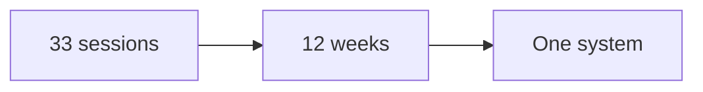
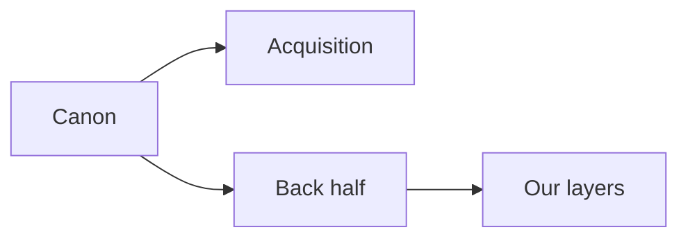

# Corpus map

This is an internal operator map. Do not publish it. It describes the canon: the
source transcripts in `framework-canon/`.

The canon holds 33 transcripts. They are numbered 00 to 34. Numbers 19 and 20
are missing. Sessions 13 and 14 are copies of each other.

The set teaches a 12-week program. In that program an expert turns what they
know into a product they can sell and deliver. The work moves from research to
message to offer to funnel to traffic to content to follow up.

Two things are true about the canon:

- It is very strong on getting new clients.
- It is thinner on what happens after a client buys. Our service and
  partnership layers fill that space.

## Corpus index

This table maps every session to a station and its main output.

| Session | Topic | Station | Main output |
|---|---|---|---|
| 00 | Getting started | Plan | Program map |
| 01 | Plan and goals | Plan | One-page plan |
| 02 | Audience sizing, social | Market | Audience size |
| 03 | Audience sizing, network | Market | Audience size |
| 04 | Avatar goals grid | Market | Avatar goals grid |
| 05 | Message intro | Message | Rough message |
| 06 | Currency and message | Message | Currency and message |
| 07 | Profit pyramid | Offer | Four levels |
| 08 | Pyramid examples | Offer | Final pyramid |
| 09 | Signature solution | Offer | Three phases, nine steps |
| 10 | Solution examples | Offer | Final solution |
| 11 | Product and price | Offer | Product outline |
| 12 | Product examples | Offer | Price and structure |
| 13 | Authority amplifier 1 | Funnel | Script outline |
| 14 | Authority amplifier 1 copy | Funnel | Script outline |
| 15 | Authority amplifier 2 | Funnel | Full script |
| 16 | Slide template | Funnel | Slide deck |
| 17 | Branding images | Funnel | Branded slides |
| 18 | Recording and editing | Funnel | Finished video |
| 21 | Funnel template | Funnel | Live funnel |
| 22 | Paid ads quick start | Traffic | Live campaign |
| 23 | Metrics dashboard | Traffic | Metrics sheet |
| 24 | Q and A | Traffic | Fixed funnel |
| 25 | Content blitz | Content | One video |
| 26 | Content intro | Content | Roadmap |
| 27 | Content plan | Content | Filled roadmap |
| 28 | Content produce | Content | Finished video |
| 29 | Content publish | Content | Post on three places |
| 30 | Content promote | Content | Audience campaign |
| 31 | Content syndicate | Content | Sharing queue |
| 32 | Winning webinar | Content | Webinar outline |
| 33 | Retargeting intro | Retargeting | Retargeting plan |
| 34 | Retargeting training | Retargeting | Live retargeting |

Note: sessions 13 and 14 are copies. Sessions 19 and 20 are missing.

## What the canon does not cover

The canon is a full acquisition line. It is light on the back half of the client
life. We fill these gaps in our service and partnership layers.

- Client onboarding after purchase.
- Day-to-day delivery and session management.
- Client success tracking and check-ins.
- Renewal, retention, and win-back.
- A clear next-offer path.
- Referral and partner programs.
- Community building and moderation.
- Team hiring, training, and sales support.
- Contracts, billing, and payment plans.
- Long-term data: cohorts and client lifetime value.
- Offboarding and alumni.

