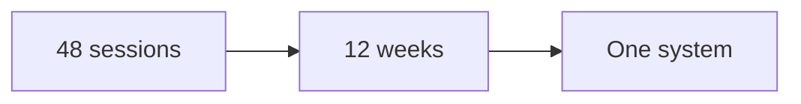
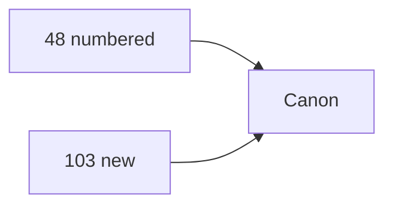
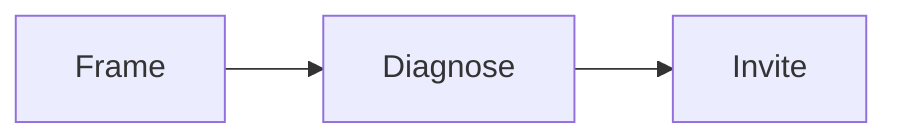
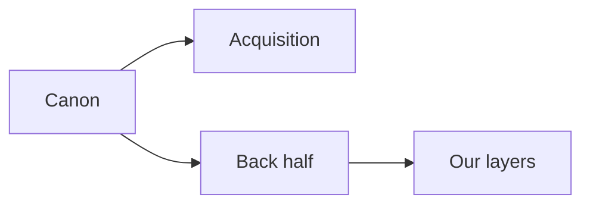

# Corpus map

This is an internal operator map. Do not publish it. It describes the canon: the
source transcripts in `framework-canon/`.

The canon holds 48 numbered transcripts (00 to 49) plus 103 more in nine
series. Numbers 19 and 20 were missing; the new uploads fill them. Sessions 13
and 14 are copies of each other. Sessions 35 to 49 are the sales block.

The set teaches a 12-week program. In that program an expert turns what they
know into a product they can sell and deliver. The work moves from research to
message to offer to funnel to traffic to content to follow up. The sales block
adds the enrollment call: how to turn a booked lead into a paying client.

Two things are true about the canon:

- It is very strong on getting new clients.
- It is thinner on what happens after a client buys. Our service and
  partnership layers fill that space.

## Corpus index

This table maps every session to a station and its main output.

| Session | Topic | Station | Main output |
|---|---|---|---|
| 00 | Getting started | Plan | Program map |
| 01 | Plan and goals | Plan | One-page plan |
| 02 | Audience sizing, social | Market | Audience size |
| 03 | Audience sizing, network | Market | Audience size |
| 04 | Avatar goals grid | Market | Avatar goals grid |
| 05 | Message intro | Message | Rough message |
| 06 | Currency and message | Message | Currency and message |
| 07 | Profit pyramid | Offer | Four levels |
| 08 | Pyramid examples | Offer | Final pyramid |
| 09 | Signature solution | Offer | Three phases, nine steps |
| 10 | Solution examples | Offer | Final solution |
| 11 | Product and price | Offer | Product outline |
| 12 | Product examples | Offer | Price and structure |
| 13 | Authority amplifier 1 | Funnel | Script outline |
| 14 | Authority amplifier 1 copy | Funnel | Script outline |
| 15 | Authority amplifier 2 | Funnel | Full script |
| 16 | Slide template | Funnel | Slide deck |
| 17 | Branding images | Funnel | Branded slides |
| 18 | Recording and editing | Funnel | Finished video |
| 21 | Funnel template | Funnel | Live funnel |
| 22 | Paid ads quick start | Traffic | Live campaign |
| 23 | Metrics dashboard | Traffic | Metrics sheet |
| 24 | Q and A | Traffic | Fixed funnel |
| 25 | Content blitz | Content | One video |
| 26 | Content intro | Content | Roadmap |
| 27 | Content plan | Content | Filled roadmap |
| 28 | Content produce | Content | Finished video |
| 29 | Content publish | Content | Post on three places |
| 30 | Content promote | Content | Audience campaign |
| 31 | Content syndicate | Content | Sharing queue |
| 32 | Winning webinar | Content | Webinar outline |
| 33 | Retargeting intro | Retargeting | Retargeting plan |
| 34 | Retargeting training | Retargeting | Live retargeting |
| 35 | Sales script intro | Enroll | Program map |
| 36 | Before the call | Enroll | Prep and roadmap |
| 37 | Pre-call mindset | Enroll | Mindset rules |
| 38 | Script intro | Enroll | Six-part script |
| 39 | Frame phase | Enroll | Call frame |
| 40 | Discover phase | Enroll | Gap audit |
| 41 | Problems phase | Enroll | Problem questions |
| 42 | Prescription phase | Enroll | 90-day plan |
| 43 | Application phase | Enroll | Fit rules |
| 44 | Invitation phase | Enroll | Invitation |
| 45 | Objection crusher | Enroll | Objection answers |
| 46 | Conclusion | Enroll | Practice plan |
| 47 | Paid strategy calls | Enroll | Paid call model |
| 48 | Funnel calculator | Enroll | Funnel numbers |
| 49 | Sales script live replay | Enroll | Live example |

Note: sessions 13 and 14 are copies. Sessions 19 and 20 are now in the
`High Ticket Launch Accelerator` series.

## The expanded corpus

The new uploads add 103 transcripts in nine series. They repeat and deepen the
numbered canon. Use them as extra source, not as a replacement.

| Series | Files | What it adds |
|---|---|---|
| High Ticket Funnels | 19 | Funnel clinics, lead magnets, enrollment script, CAC funnel |
| 14D HTCLF | 16 | A 14-step course launch funnel |
| Winning Webinar | 14 | Webinar planning, slides, email, retargeting, metrics |
| Youtube Content | 14 | Public videos on funnels, ads, copy, and offers |
| Live Sessions | 11 | Live calls, offer building, lead magnets, pricing |
| High Ticket Course Launch | 11 | An earlier version of the 14-step launch |
| Perfect Offer | 11 | Offer, currency, message, and product roadmap |
| Certification | 4 | Certification sessions |
| High Ticket Launch Accelerator | 3 | Sessions 19 and 20, plus a currency feedback clip |

Two series overlap. `14D HTCLF` and `High Ticket Course Launch` teach the same
14-step launch. `High Ticket Launch Accelerator` fills the old 19 and 20 gap.

The `Winning Webinar` series is the source for phase 2 of enrollment: lead to
webinar to call. It supports the Enroll station.

The new series stay on the same ground as the numbered canon. They are strong on
offers, funnels, webinars, and content. They do not cover the back half of the
client life.

## The sales block

Sessions 35 to 49 teach the enrollment call. They cover how to frame the call,
audit the lead, prescribe a plan, invite, and handle objections. They also cover
paid strategy calls and funnel math. The block ends with a live replay.

The block is strong. It gives us the words, the questions, and the checkpoints.
Our service layer turns them into a done-for-you enrollment asset.

## What the canon does not cover

The canon is a full acquisition line. It is light on the back half of the client
life. We fill these gaps in our service and partnership layers.

- Client onboarding after purchase.
- Day-to-day delivery and session management.
- Client success tracking and check-ins.
- Renewal, retention, and win-back.
- A clear next-offer path.
- Referral and partner programs.
- Community building and moderation.
- Team hiring and sales-team leadership.
- Contracts, billing, and payment plans.
- Long-term data: cohorts and client lifetime value.
- Offboarding and alumni.

