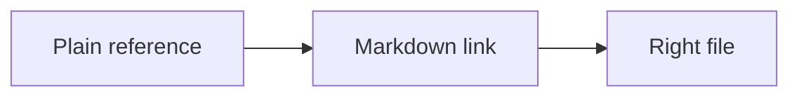
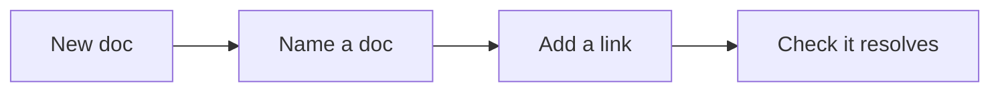

# Ops cross-reference links — Spec

Status: active. Owner: RED operations. This spec is internal. The manual it
describes is public and lives in `docs/ops/`.

## 1. Goal

Every reference in the ops manual that names another piece of material must be a
Markdown link to that material. A reader who sees "read the market playbook" or
"use the checkpoint card" must be able to click through to the file.

## 2. Why now

The ops manual was written in one pass. Many cross-references are plain text.
Some links exist but the link text does not match the target. Readers cannot
navigate the manual by reference.

## 3. Scope

In scope: `docs/ops/playbooks/*.md`, `docs/ops/sops/*.md`,
`docs/ops/checklists/*.md`.

Out of scope: `docs/ops/index.md` (already fully linked), `docs/method/*.md`,
`docs/glossary.md`, and all other docs.

## 4. Non-goals

- No new cross-references. Only link references that already exist in the text.
- No prose rewrite. Only wrap the existing words in a link.
- No new "Related" sections in checklists or SOPs.
- No change to headings, diagrams, or file names.
- No change to `framework-canon/`.

## 5. Link rule

Link a reference when the sentence tells the reader to consult a named manual
document or a named artifact that has a manual doc. Directive verbs include:
read, get, use, open, review, pull, print, see, follow, check, update, build,
share.

Do not link:

- Generic plurals with no single target: "the numbers". A plural with a section
  index, like "the playbooks", links to that index.
- Incidental mentions where the word is a common noun or a metric label.
- Outputs, records, and metrics lists where the item is a produced artifact.
- Self-references (a doc naming itself).

## 6. Target map

| Reference text | Target |
|---|---|
| the market playbook | `playbooks/market.md` |
| the funnel playbook | `playbooks/funnel.md` |
| the content playbook | `playbooks/content.md` |
| the message playbook | `playbooks/message.md` |
| the nurture playbook | `playbooks/email-nurture.md` |
| the numbers playbook | `playbooks/numbers.md` |
| the offer playbook | `playbooks/offer.md` |
| the delivery playbook | `playbooks/delivery.md` |
| the super group playbook | `playbooks/super-group.md` |
| the outreach playbook | `playbooks/outreach.md` |
| the lead magnet playbook | `playbooks/lead-magnet.md` |
| the product roadmap | `checklists/product-roadmap.md` |
| the client scorecard | `checklists/client-scorecard.md` |
| the checkpoint card | `checklists/checkpoint-card.md` |
| the slide template | `checklists/slide-template.md` |
| the content crusher | `checklists/content-crusher.md` |
| the objection sheet | `checklists/objection-sheet.md` |
| the reputation track | `checklists/reputation-track.md` |
| the case study checklist | `checklists/case-study.md` |
| the case study | `checklists/case-study.md` |
| the kickoff checklist | `checklists/kickoff.md` |
| the community rules | `checklists/community-rules.md` |
| the enrollment script | `checklists/enrollment-script.md` |
| the roadmap SOP | `sops/brain-dump-to-roadmap.md` |

Paths are relative to the file being edited. Checklists link to a sibling
checklist by file name. Playbooks and SOPs link to a checklist with
`../checklists/`. Playbooks link to an SOP with `../sops/`.

## 7. Edit inventory

### 7.1 Playbooks

| File | Line | Current text | New link |
|---|---|---|---|
| delivery.md | 46 | Use the content crusher and the slide template. | content crusher, slide template |
| delivery.md | 50 | Review the scorecard each week. | client scorecard |
| delivery.md | 95 | use the kickoff checklist. | kickoff checklist |
| enroll.md | 112 | use the checkpoint card. | checkpoint card |
| enrollment-service.md | 95 | use the checkpoint card. | checkpoint card |
| offer.md | 45 | See the roadmap SOP. | brain dump to roadmap SOP |
| certification.md | 25 | The playbooks and the roadmap. | product roadmap |
| certification.md | 37 | Train the team on the playbooks and the roadmap. | product roadmap |
| partnership.md | 26 | The client scorecard and the case study. | client scorecard, case study |
| partnership.md | 28 | The community rules. | community rules |
| authority-video.md | 94 | link text "Hook lines" | rename to "Hooks and headlines" |

### 7.2 SOPs

| File | Line | Current text | New link |
|---|---|---|---|
| reputation.md | 14 | Use the case study checklist. | case study checklist |
| role-play-practice.md | 23 | Use the checkpoint card. | checkpoint card |
| role-play-practice.md | 42 | update the objection sheet. | objection sheet |
| slide-deck-build.md | 19 | Open the slide template. | slide template |
| renewal.md | 12 | Pull the client scorecard. | client scorecard |
| community-moderation.md | 12 | Share the rules and the start guide. | community rules |
| certification-exam.md | 20 | Train the operator on the playbooks and the roadmap. | product roadmap |

### 7.3 Checklists

| File | Line | Current text | New link |
|---|---|---|---|
| avatar-ecosystem.md | 15 | Read the market playbook. | market playbook |
| booking-page.md | 15 | Read the funnel playbook. | funnel playbook |
| content-crusher.md | 13 | Get the product roadmap. | product roadmap |
| content-crusher.md | 15 | Read the content playbook. | content playbook |
| currency-calculator.md | 15 | Read the message playbook. | message playbook |
| email-sequence.md | 15 | Read the nurture playbook. | nurture playbook |
| funnel-math.md | 15 | Read the numbers playbook. | numbers playbook |
| hooks-headlines.md | 15 | Read the message playbook. | message playbook |
| launch-calendar.md | 15 | Read the offer and funnel playbooks. | offer, funnel |
| launch-calendar.md | 22 | Day 5: build the product roadmap. | product roadmap |
| lead-magnet-pdf.md | 15 | Read the lead magnet playbook. | lead magnet playbook |
| pricing.md | 13 | Get the one currency and the roadmap. | product roadmap |
| pricing.md | 15 | Read the offer playbook. | offer playbook |
| product-roadmap.md | 15 | Read the offer playbook. | offer playbook |
| slide-template.md | 15 | Read the delivery playbook. | delivery playbook |
| super-group-setup.md | 15 | Read the super group playbook. | super group playbook |
| two-step-outreach.md | 15 | Read the outreach playbook. | outreach playbook |
| checkpoint-card.md | 14 | Read the product roadmap. | product roadmap |
| enrollment-script.md | 14 | Get the product roadmap. | product roadmap |
| enrollment-script.md | 16 | Read the checkpoint card. | checkpoint card |
| session-guide.md | 14 | Review the client scorecard. | client scorecard |
| role-play-drill.md | 14 | Print the script and the checkpoint card. | enrollment script, checkpoint card |
| role-play-drill.md | 22 | Score the call on the checkpoint card. | checkpoint card |
| renewal-winback.md | 13 | Pull the client scorecard. | client scorecard |
| case-study.md | 28 | Add it to the reputation track. | reputation track |
| strategy-session-call.md | 13 | Get the product roadmap. | product roadmap |

## 8. Acceptance criteria

Given any ops playbook, SOP, or checklist,
When its text names another manual doc or a named artifact,
Then that name is a Markdown link to the right file.

Given any link in the ops manual,
When the target is resolved,
Then the file exists.

Given any link in the ops manual,
When the link text is compared to the target title,
Then the text matches the target.

Given the ops manual,
When a link checker runs over `docs/ops/`,
Then there are zero broken links.

## 9. Constraints

- Follow `AGENTS.md` in full.
- Keep the reading level at 3rd to 5th grade.
- Do not change any sentence beyond wrapping words in a link.
- Do not add or remove list items.
- Do not touch `framework-canon/`.

## 10. Assumptions

- ASSUMPTION: "the product roadmap" and "the roadmap" link to the ops checklist
  `checklists/product-roadmap.md`, not the method page `method/product-roadmap.md`.
  The ops manual stays self-contained. Flip this if the method page is wanted.
- ASSUMPTION: "the case study" links to the ops checklist
  `checklists/case-study.md`.
- ASSUMPTION: A generic plural links to its section index when one exists.
  "the playbooks" links to `docs/ops/index.md`. A plural with no index, like
  "the numbers", stays unlinked.
- ASSUMPTION: "the start guide" in `sops/community-moderation.md` has no target
  file. It stays unlinked.

## 11. Open questions

- Q1: Resolved. "the playbooks" links to `docs/ops/index.md`. Applied in
  `playbooks/certification.md` (lines 25 and 37) and
  `sops/certification-exam.md` (line 20).
- Q2: Resolved. Ops content links to ops docs. Method content links to method
  docs. So "the product roadmap" in `docs/ops/` links to the ops checklist
  `checklists/product-roadmap.md`. This is the current state.

### Q2 context

Two files describe the product roadmap.

| Option | File | What it is |
|---|---|---|
| A (chosen) | `checklists/product-roadmap.md` | "Product roadmap checklist". A 34-line tick list. It builds the roadmap: group the dump into three stages, break each into three steps, name each stage. It is the ops build tool. |
| B | `method/product-roadmap.md` | "The product roadmap". A 69-line explainer. It defines the roadmap, the 3/9/27 shape, how we build it, why every step needs a tool, and one map many uses. It is the concept page. |

The rule: a reference resolves inside its own section. Ops links to ops. Method
links to method. This keeps each section self-contained.

Cross-section links are still allowed when they are deliberate. The ops
playbooks keep their 6 links to method pages. Three are labeled "Method:" in
"Related" sections. Three name a method-only concept (the enrollment
evolution). These are not changed.

## 12. Durable rule

The one-time fix is not enough. Future agents must keep linking named
references. The rule now lives in:

- `AGENTS.md` section 4: link named references. Added to the ship checklist.
- `internal/ops-spec.md`: added to the templates note, the constraints, and the
  acceptance criteria.

