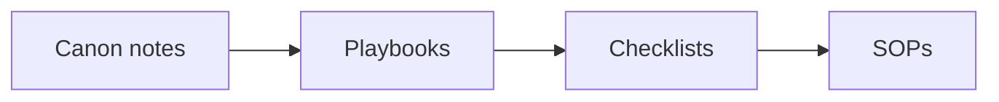
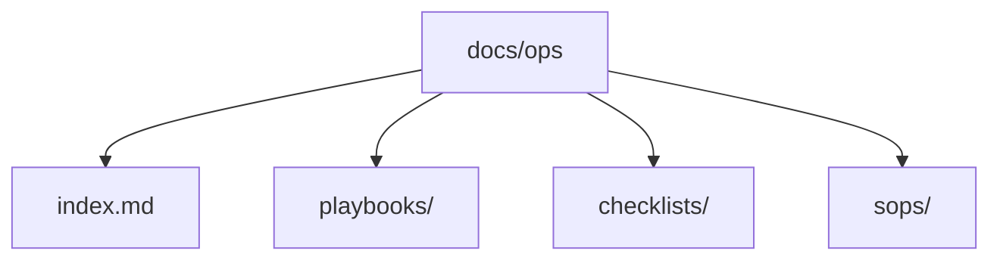

# RED Method Enterprise Operations Manual — Spec

Status: active. Owner: RED operations. This spec is internal. The manual it
describes is public and lives in `docs/ops/`.

## 1. Goal

Turn the RED canon's internal notes into one complete, usable operations manual:
playbooks, checklists, and SOPs that any RED operator can follow to run the
method for a client. This is the "how we run it" layer. It is the
enterprise-grade manual for the RED Method.



## 2. Why now

`internal/service-ops.md` names the assets we still need to build. `internal/
stations.md` says each station can become its own playbook. The platform SPEC
section 12.5 lists the same gaps. This spec builds them in one place.

## 3. Non-goals

- Public docs. The manual is hosted in `docs/ops/` and added to the MkDocs
  site. It must not mention session numbers or internal gaps.
- Not a rewrite of the existing `docs/` or `internal/` files.
- Not code. No platform, backend, or frontend changes.
- Not verbatim canon copy. No brand names and no person names.
- Not client-specific. Every doc is generic and reusable.

## 4. Audience

RED operators. Each doc names its reader:

- Delivery lead: runs the build and the client relationship.
- Coach: teaches and coaches the client.
- Enrollment specialist: builds and runs the enrollment asset.
- Partnership lead: keeps clients for years.
- Community manager: runs the client community.

## 5. Structure



- `docs/ops/index.md`: the manual home. Purpose, how to use it, the doc
  types, a map of every doc, owners, and the review cadence.
- `docs/ops/playbooks/`: one playbook per station and per service line.
  A playbook explains the goal, the steps, the gate, and the metrics.
- `docs/ops/checklists/`: one-page tick lists for recurring work.
- `docs/ops/sops/`: precise, repeatable procedures.

## 6. Doc types and templates

Every doc follows its template. Every doc has a short lead-in sentence before
each Mermaid diagram. Keep diagrams to fewer than 5 elements.

### 6.1 Playbook template

```markdown
# <Name> playbook

One sentence: what this playbook is for.

## Goal
What good looks like.

## When to use
The trigger and the stage.

## Roles
Who does what.

## Inputs
What must exist before you start.

## Steps
1. Numbered steps. One action per step.

## Gate
The check to pass before moving on.

## Metrics
The numbers to watch.

## Outputs
What you produce.

## Common failures
What goes wrong and how to avoid it.

## Related
- Checklist: <link>
- SOP: <link>
```

### 6.2 Checklist template

```markdown
# <Name> checklist

One sentence: when to run this list.

## Before you start
- [ ] Item

## Steps
- [ ] Item

## Done when
- [ ] Item
```

### 6.3 SOP template

```markdown
# <Name> SOP

One sentence: what this procedure does.

## Trigger
What starts it.

## Roles
Who runs it.

## Procedure
1. Numbered steps.

## Decision points
Where to branch.

## Escalation
Who to tell when it goes wrong.

## Records
What to save and where.
```

## 7. File list

### 7.1 Index

- `docs/ops/index.md`

### 7.2 Playbooks

- `playbooks/plan.md`
- `playbooks/market.md`
- `playbooks/message.md`
- `playbooks/offer.md`
- `playbooks/funnel.md`
- `playbooks/traffic.md`
- `playbooks/content.md`
- `playbooks/retargeting.md`
- `playbooks/enroll.md`
- `playbooks/delivery.md`
- `playbooks/enrollment-service.md`
- `playbooks/partnership.md`

### 7.3 Checklists

- `checklists/kickoff.md`
- `checklists/module-production.md`
- `checklists/session-guide.md`
- `checklists/client-scorecard.md`
- `checklists/case-study.md`
- `checklists/enrollment-script.md`
- `checklists/checkpoint-card.md`
- `checklists/objection-sheet.md`
- `checklists/role-play-drill.md`
- `checklists/renewal-winback.md`
- `checklists/referral-partner.md`
- `checklists/community-rules.md`
- `checklists/reputation-track.md`

### 7.4 SOPs

- `sops/client-onboarding.md`
- `sops/module-delivery.md`
- `sops/session-coaching.md`
- `sops/case-study-capture.md`
- `sops/enrollment-asset-build.md`
- `sops/role-play-practice.md`
- `sops/renewal.md`
- `sops/referral.md`
- `sops/community-moderation.md`
- `sops/reputation.md`
- `sops/quarterly-review.md`

## 8. Source map

Use these existing docs as the source. Do not read `framework-canon/`.

| Doc | Source |
|---|---|
| Station playbooks | `internal/stations.md`, `internal/corpus-map.md` |
| Timing and hard rules | `internal/cadence.md` |
| Service and partnership | `internal/service-ops.md` |
| Public method shape | `docs/method/*.md`, `docs/glossary.md` |

## 9. Acceptance criteria

Given a reader opens `docs/ops/index.md`,
When they follow a link to any playbook, checklist, or SOP,
Then the file exists, follows its template, and has a Mermaid diagram.

Given any new file in `docs/ops/`,
When it is checked against the repo rules,
Then it has no brand name, no person name, no session number, and no verbatim
canon text.

Given any new file,
When its text is read,
Then sentences are short, the voice is active, and the reading level is 3rd to
5th grade.

Given `docs/ops/index.md`,
When it is read,
Then it links to every playbook, checklist, and SOP in the file list.

## 10. Constraints

- Follow `AGENTS.md` in full.
- Never write the original brand name. Call it "the framework" or "the system".
- Never name people from the source transcripts.
- Do not read or copy `framework-canon/`. Work from the synthesized docs.
- Use Mermaid for every new idea in a `.md` file.
- Keep file names short and in plain English.
- Do not add secrets, keys, or client data.

## 11. Assumptions

- ASSUMPTION: The manual is public and hosted in `docs/ops/`. It stays free of
  session numbers and internal gaps.
- ASSUMPTION: "RED Method Enterprise" means the enterprise-grade operations
  layer for the RED Method business, not a separate product tier.
- ASSUMPTION: The nine stations plus three service lines are the right playbook
  set. The platform SPEC section 12.5 agrees.
- ASSUMPTION: Checklists and SOPs may overlap in topic. The checklist is the
  quick tick list; the SOP is the full procedure.

## 12. Open questions

- Q1: Resolved. The manual is hosted in `docs/ops/` as a public section.
- Q2: Who is the named owner for each playbook?
- Q3: The missing canon modules (19 and 20) arrived in the `High Ticket Launch
  Accelerator` series. A separate nurture and follow-up playbook is still open.
