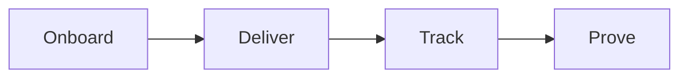

# Delivery playbook

This playbook delivers the product and creates real results for the client.

## Goal

Onboard the client well. Deliver one module per week for 6 to 12 weeks. Teach on
one day and coach on another. Track progress. Collect a case study when results
land.

## When to use

Use this playbook in the Serve stage, after the client buys. It runs for the
full program. It starts at kickoff and ends at the case study.

## Roles

- Delivery lead: owns the client relationship and the results.
- Coach: teaches and coaches the client.
- Producer: builds each module.
- Client: does the work and shares the numbers.

## Inputs

- A signed client and a start date.
- The signature solution and the product outline.
- The success goals from kickoff.
- The module production standard.

## Steps

1. Onboard the client with a welcome and a kickoff.
2. Set success goals and a start date.
3. Build the module plan for 6 to 12 weeks.
4. Produce one module per week.
5. Teach the module on one day.
6. Coach the client on another day.
7. Track attendance, progress, and results.
8. Review the scorecard each week.
9. Fix what is stuck.
10. Collect a case study the moment results land.

## Gate

Results are measured against the goals set at kickoff. If the results do not
match the goals, fix the plan before you close.

## Metrics

- Module completion.
- Attendance.
- Client results against goals.
- Client scorecard.
- Case studies collected.

## Outputs

- Client results.
- A case study.
- A reference.

## Common failures

- Weak kickoff. Fix: use the kickoff checklist.
- No goals. Fix: set them at kickoff.
- Skipping the scorecard. Fix: review it each week.
- Waiting to collect proof. Fix: capture the case study when results land.

## Related

- Checklist: [Kickoff](../checklists/kickoff.md)
- Checklist: [Module production](../checklists/module-production.md)
- Checklist: [Session guide](../checklists/session-guide.md)
- Checklist: [Client scorecard](../checklists/client-scorecard.md)
- Checklist: [Case study](../checklists/case-study.md)
- SOP: [Client onboarding](../sops/client-onboarding.md)
- SOP: [Module delivery](../sops/module-delivery.md)
- SOP: [Session coaching](../sops/session-coaching.md)
- SOP: [Case study capture](../sops/case-study-capture.md)

Delivery has four moves.

