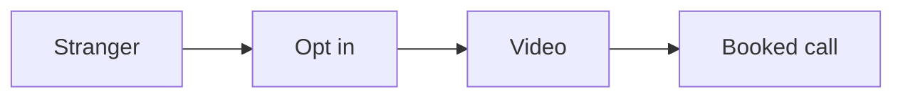

# Funnel playbook

This playbook builds the simple path that turns a stranger into a booked call.

## Goal

Build a simple path that turns a stranger into a booked call. Good looks like a
live funnel and a finished authority video.

## When to use

Use this after the offer. It is Station 4. It covers sessions 13 to 18 and 21.

## Roles

- Delivery lead: runs the build.
- Coach: checks the script and the pages.
- Client: records the video.

## Inputs

- The signature solution.
- The one message.
- Brand assets.

## Steps

1. Write a short video that shows the signature solution.
2. Use a six-part script: promise, proof, problems, steps, context, action.
3. Check the script is right before you make slides.
4. Build four pages: opt in, video, calendar, confirmation.
5. Add branding to the slides and pages.
6. Record the video.
7. Edit the video.
8. Add a homework video so people show up ready.
9. Turn the funnel on.

The funnel moves a stranger to a booked call.

## Gate

The script is right before the slides. The funnel captures, engages, and
converts. Pages follow a clean brand.

## Metrics

- Page conversion.
- Show rate.

## Outputs

- A live funnel.
- A finished authority video.

## Common failures

- Slides come before the script. Fix: fix the script first.
- Pages look off brand. Fix: use the brand assets.
- The funnel leaks. Fix: check each page in order.

## Related

- Checklist: None yet.
- SOP: None yet.
