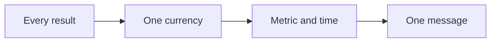

# Message playbook

This playbook turns a category into one currency and one clear message.

## Goal

Pick one currency and write one message. Good looks like one measured result
with a metric and a timeline.

## When to use

Use this after the market. It is Station 2. It covers sessions 05 and 06. This
is the hardest gate in the line.

## Roles

- Delivery lead: runs the session.
- Coach: pushes for one clear result.
- Client: approves the message.

## Inputs

- The avatar snapshot.
- The goals grid.
- A list of every result the client could sell.

## Steps

1. List every result you could sell.
2. Pick the one result that is critical and specific.
3. Give the result a metric.
4. Give the result a timeline.
5. Name the three main obstacles the buyer faces.
6. Write one message. Tie the person, the result, and the time together.
7. Get the message approved.

One currency flows into the message.

## Gate

One currency. One word if possible. The message has a metric and a timeline. It
is approved before you move on. Do not pass this gate without approval.

## Metrics

- Metric and timeline.
- Message clarity.

## Outputs

- A currency calculator.
- One message.

## Common failures

- More than one currency. Fix: pick one and drop the rest.
- No metric or timeline. Fix: add a number and a date.
- The message is not approved. Fix: stop and get a clear yes.

## Related

- Checklist: None yet.
- SOP: None yet.
