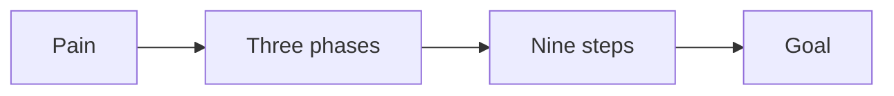

# Offer playbook

This playbook packages the work into a product with a price.

## Goal

Package the work into a product with a price. Good looks like a profit pyramid,
a signature solution, a product outline, and a price.

## When to use

Use this after the message. It is Station 3. It covers sessions 07 to 12.

## Roles

- Delivery lead: runs the design.
- Coach: checks the path and the price.
- Client: gives feedback before design.

## Inputs

- The one currency.
- The one message.
- The avatar snapshot.

## Steps

1. Split the market into four levels by success.
2. Choose which levels you serve and which you do not.
3. Build a visual path from the buyer's pain to the goal.
4. Give the path three phases and nine steps.
5. Choose how you deliver: group program, one-to-one, or done for you.
6. Set a premium price.
7. Outline a 6 to 12 week program, one module per week.
8. Get feedback before design.

The offer path has three phases and nine steps.

## Gate

The offer uses the one currency. Each level has one clear action. The path has
three phases and nine steps. Get feedback before design.

## Metrics

- Price.
- Conversion rate.

## Outputs

- A profit pyramid.
- A signature solution.
- A product outline.
- A price.

## Common failures

- The offer uses a new currency. Fix: tie it back to the one currency.
- The path is too long. Fix: keep three phases and nine steps.
- Design starts before feedback. Fix: get feedback first.

## Related

- Checklist: [Module production](../checklists/module-production.md)
- SOP: [Module delivery](../sops/module-delivery.md)
