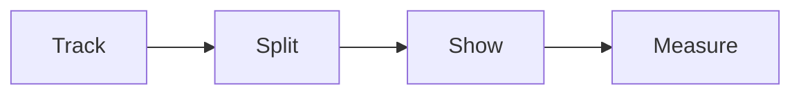

# Retargeting playbook

This playbook brings back the people who got stuck in the funnel.

## Goal

Show the right ad to the right group. Bring back people who visited but did not
act. Follow the six steps in order.

## When to use

Use this playbook at Station 7, after traffic is live. Sessions 33 and 34. Use
it on the run line for every funnel step.

## Roles

- Delivery lead: owns the plan and the budget.
- Ads specialist: builds the audiences and the ads.
- Coach: checks the tracking and the goals.
- Client: approves the plan.

## Inputs

- A live ad campaign.
- Tracking and goals set up.
- The funnel pages and the authority video.
- The one currency and message.

## Steps

1. Add tracking and goals to every funnel step.
2. Split audiences by where each person stopped.
3. Pick the right group for each ad.
4. Exclude people who already bought.
5. Show one focused ad to each group.
6. Measure the result and repeat.

## Gate

Follow the six steps in order. Target the right people. Exclude the right
people. Ignore the rest.

## Metrics

- Return on ad spend lift.
- Cost per lead by audience.
- Recovery rate.
- Frequency and reach.

## Outputs

- A retargeting plan.
- A set of ads.
- A live retargeting campaign.

## Common failures

- Showing the same ad to everyone. Fix: split by where they stopped.
- Forgetting to exclude buyers. Fix: add the buyer list.
- Changing many things at once. Fix: change one variable at a time.
- No tracking. Fix: set up tracking first.

## Related

- Playbook: [Traffic playbook](traffic.md)
- Playbook: [Content playbook](content.md)
- Playbook: [Funnel playbook](funnel.md)
- No checklist or SOP exists for this station yet.

Retargeting follows six steps in order.

