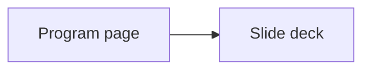

# Program pages and slide decks spec

## Goal

Build one learning page and one Reveal.js slide deck for every program folder in
`framework-canon/`. Publish both through the MkDocs site.

## Audience and size

Write for a new learner. Use clear steps, simple examples, and short practice
tasks. Build about 250 to 300 slides across the nine programs.

## Program layout

Move the 48 files in `12 Week Launch Accelerator/` into the existing
`High Ticket Launch Accelerator/` folder. Keep the three files already there.
The combined folder has 51 files and gets one page and one deck. The other eight
folders each get one page and one deck.

## Public output

- Add a `Programs` section to the MkDocs navigation.
- Add one summary page for each of the nine folders under `docs/programs/`.
- Add one standalone Reveal.js HTML deck for each program.
- Each summary page must link to its deck and open the link in a new tab.
- MkDocs must copy every deck into the built site.

Each summary page gives a short program overview, who it helps, what you will
learn, and a clear link to its deck. Add one small Mermaid diagram to each new
Markdown page.

Each deck must teach the program in a useful order. Include learning goals,
plain explanations, fresh examples, short tasks, checks, and a final action
plan. Keep each slide focused on one idea.

## Writing and source rules

- Do not copy source text or use direct quotes.
- Do not name people from the source files.
- Do not use the forbidden brand name. Use plain, generic terms.
- Do not mention source files, session numbers, or internal gaps in public pages
  or decks.
- Use simple words and short sentences. Define a new term the first time it
  appears.
- Treat sample metrics as practice targets, not promises.

## Design and access

- Use a pinned Reveal.js release and the viewport-native layout in the Reveal.js
  skill.
- Keep text readable on phones, tablets, and desktop screens.
- Use only original CSS diagrams and shapes. Do not add images copied from the
  source files.
- Provide slide numbers, progress, keyboard controls, and touch navigation.

## Verification

- Confirm the merged folder has 51 files and the old folder is gone.
- Confirm the other eight source folders are unchanged.
- Confirm there are nine summary pages and nine decks.
- Confirm the decks contain 250 to 300 slides in total.
- Scan new public files for forbidden names, person names, session references,
  and copied source phrases.
- Run `uv run mkdocs build --strict`.
- Confirm each deck is present in `site/` and each page link resolves.
- Check every slide for overflow at phone portrait, phone landscape, and desktop
  sizes.

## Scope

- Build the local MkDocs site only. There is no live deploy step in this work.
- Preserve unrelated working-tree changes.
- Keep `framework-canon/` ignored and untracked.

## Diagram

The site page opens its matching deck.

