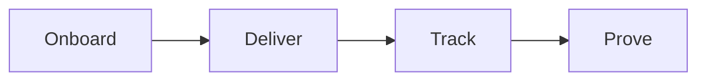
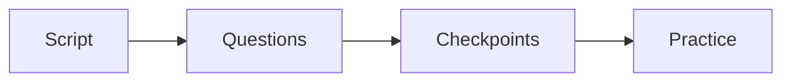
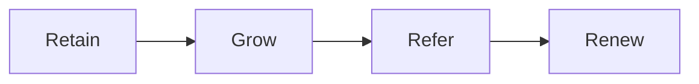
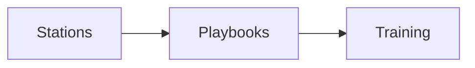

# Service ops

This is an internal operator map. Do not publish it. It covers our service and
partnership layers, plus the internal assets we still need to build.

The canon builds the machine. The service layer is where we run it for the
client as a white-glove service. This is our layer. The canon is thin here, so
we define it.

## Service line

**Goal**: deliver the product and create real results.

**What happens**:

- Onboard the client with a clear welcome and a kickoff.
- Set success goals and a start date.
- Deliver one module per week for 6 to 12 weeks.
- Teach on one day and coach on another.
- Track attendance, progress, and results.
- Collect a case study the moment results land.

**Output**: client results, a case study, and a reference.

**Gate**: results are measured against the goals set at kickoff.

Parts to build for this layer:

- A kickoff checklist.
- A module production standard.
- A session guide for the coach.
- A simple scorecard for each client.
- A case study template.

## Enrollment service

The canon teaches the enrollment call (sessions 35 to 49). We turn it into a
done-for-you asset. This is a white-glove add-on in the Serve stage.

**Goal**: help the client enroll more customers without feeling pushy or fake.

**What happens**:

- We write the sales script from the client's one currency and roadmap.
- We build the question set: exact current numbers, goal numbers, and gaps.
- We set the checkpoints: intent, commitment, value, confidence, and desire.
- We write answers to the common objections.
- We practice with the client and their team using role play.
- We review recorded calls and note where each call ended.

**Output**: a ready enrollment script, a question guide, and a checkpoint card.

**Gate**: the script is clear, the gates are in order, and the team can run it
without pressure.

Parts to build for this layer:

- An enrollment script template tied to the product roadmap.
- A question bank keyed to the one currency.
- A one-page checkpoint card.
- An objection answer sheet.
- A role-play drill guide.

## Partnership line

A one-time program is a project. A partnership is a relationship. This is our
long-term layer.

**Goal**: keep the client for years as their results and assets grow.

**What happens**:

- Hold regular check-ins.
- Watch for clients who are quiet or stuck.
- Offer the next step at the right time.
- Build a community of clients.
- Ask happy clients for referrals.
- Renew and expand the work.

**Output**: longer client life, more revenue per client, and advocates.

**Gate**: every client has a next step and a reason to stay.

Parts to build for this layer:

- A renewal and win-back plan.
- A clear next-offer path.
- A referral and partner plan.
- A client community with simple rules.
- A reputation track: reviews, stories, and press.

## What we build next

Each station can become its own playbook. For example:

- A playbook for the message station.
- A playbook for the enrollment service.
- A playbook for delivery and client success.
- A playbook for the partnership and renewal loop.

