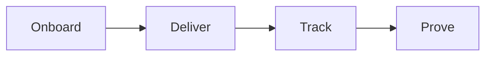
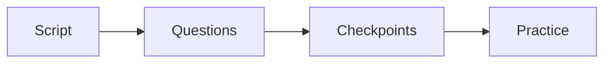
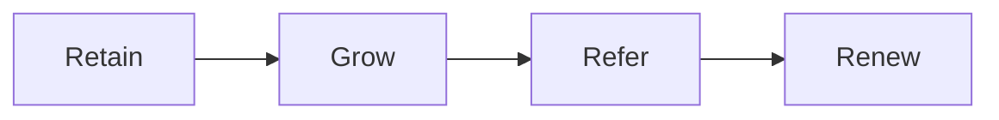
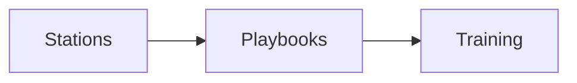
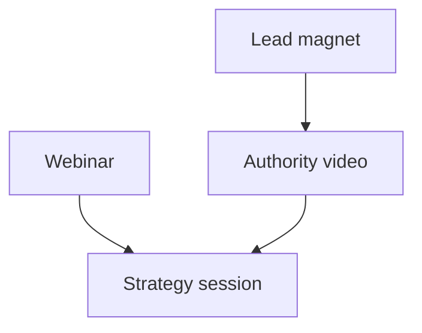
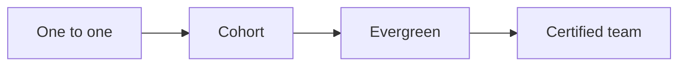

# Service ops

This is an internal operator map. Do not publish it. It covers our service and
partnership layers, plus the internal assets we still need to build.

The canon builds the machine. The service layer is where we run it for the
client as a white-glove service. This is our layer. The canon is thin here, so
we define it.

## Service line

**Goal**: deliver the product and create real results.

**What happens**:

- Onboard the client with a clear welcome and a kickoff.
- Set success goals and a start date.
- Deliver one module per week for 6 to 12 weeks.
- Teach on one day and coach on another.
- Track attendance, progress, and results.
- Collect a case study the moment results land.

**Output**: client results, a case study, and a reference.

**Gate**: results are measured against the goals set at kickoff.

These parts are built. See the operations manual in `docs/ops/`:

- Kickoff checklist: `docs/ops/checklists/kickoff.md`.
- Module production standard: `docs/ops/checklists/module-production.md`.
- Session guide: `docs/ops/checklists/session-guide.md`.
- Client scorecard: `docs/ops/checklists/client-scorecard.md`.
- Case study template: `docs/ops/checklists/case-study.md`.

## Enrollment service

The canon teaches the enrollment call (sessions 35 to 49). The `High Ticket
Funnels` and `Live Sessions` series add more enrollment and offer material. We
turn it into a done-for-you asset. This is a white-glove add-on in the Launch
stage.

**Goal**: help the client enroll more customers without feeling pushy or fake.

**What happens**:

- We write the sales script from the client's one currency and roadmap.
- We build the question set: exact current numbers, goal numbers, and gaps.
- We set the checkpoints: intent, commitment, value, confidence, and desire.
- We write answers to the common objections.
- We practice with the client and their team using role play.
- We review recorded calls and note where each call ended.

**Output**: a ready enrollment script, a question guide, and a checkpoint card.

**Gate**: the script is clear, the gates are in order, and the team can run it
without pressure.

These parts are built. See the operations manual in `docs/ops/`:

- Enrollment script template: `docs/ops/checklists/enrollment-script.md`.
- Question bank: `docs/ops/sops/enrollment-asset-build.md`.
- Checkpoint card: `docs/ops/checklists/checkpoint-card.md`.
- Objection answer sheet: `docs/ops/checklists/objection-sheet.md`.
- Role-play drill guide: `docs/ops/checklists/role-play-drill.md`.

## Partnership line

A one-time program is a project. A partnership is a relationship. This is our
long-term layer.

**Goal**: keep the client for years as their results and assets grow.

**What happens**:

- Hold regular check-ins.
- Watch for clients who are quiet or stuck.
- Offer the next step at the right time.
- Build a community of clients.
- Ask happy clients for referrals.
- Renew and expand the work.

**Output**: longer client life, more revenue per client, and advocates.

**Gate**: every client has a next step and a reason to stay.

These parts are built. See the operations manual in `docs/ops/`:

- Renewal and win-back plan: `docs/ops/checklists/renewal-winback.md`.
- Next-offer path: `docs/ops/playbooks/partnership.md`.
- Referral and partner plan: `docs/ops/checklists/referral-partner.md`.
- Client community rules: `docs/ops/checklists/community-rules.md`.
- Reputation track: `docs/ops/checklists/reputation-track.md`.

## What we build next

Each station now has its own playbook. See the operations manual in `docs/ops/`.
The set covers all nine stations and the three service lines.

## New service assets from the canon

The extra series add four service assets we now build for the client. These are
ours. The canon only hints at them.

- **Authority video kit.** One flagship video plus nine step videos, all from
  the 6-block script. This is a done-for-you asset.
- **Lead magnet kit.** One hot step becomes a one-page cheat sheet and a short
  PDF. We build it from the client's roadmap.
- **Webinar kit.** A six-phase run of show, slides, email, and retargeting. This
  is the scaled path of enrollment.
- **Strategy session kit.** A paid roadmap session. It qualifies the lead,
  earns revenue, and bridges to the program.

## Delivery and ascension

The canon is thin after the sale. We define the back half.

- Deliver on the ladder: one to one beta, then a live cohort, then evergreen.
- Give every step one deliverable. Use the Content Crusher and the slide
  template.
- Audit the client against their own roadmap every 90 days.
- Turn each of the nine steps into a small offer. Feed the foundation offer.
- Offer the next step at the right time. Build the four-offer ladder.
- Certify the client's team so they can run the system without us.

## What we build next

Each station and each service line now has a playbook, plus the new asset
playbooks: numbers, lead magnet, authority video, webinar, email and nurture,
super group, outreach, strategy session, and certification. See the operations
manual in `docs/ops/`.
