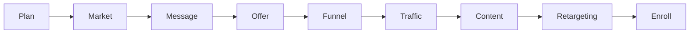
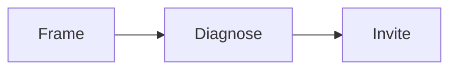
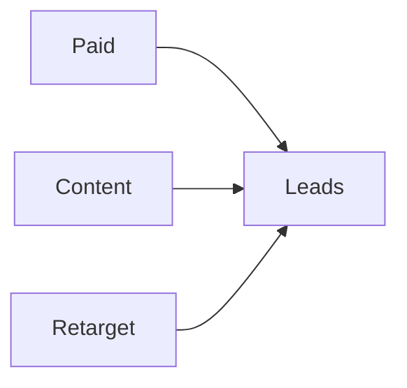
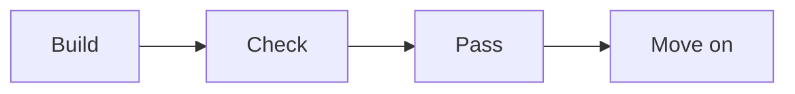

# Stations

This is an internal operator map. Do not publish it. It covers the build line,
station by station, with the gate and the metric for each one.

The build line is the 12-week program. Each station has one job. Each station
has an output. Each station has a gate you must pass before moving on.

## Public structure mapping

The public docs describe the engagement as three phases, nine motions, and 27
steps. Stages are Build, Launch, Serve, Grow, Partner. This table maps the
public structure to the internal stations.

Serve is the client's work. They serve their customers with the new model. We
build the machine and support it. Grow breaks the foundation offer into smaller
offers. Each smaller offer is a new entry point and raises customer lifetime
value.

| Phase | Motion | Steps (public) | Internal station | Sessions |
|---|---|---|---|---|
| Refine Offer | Position | Set goals and numbers | Plan | 00, 01 |
| Refine Offer | Position | Size the market | Market | 02, 03 |
| Refine Offer | Position | Pick one market and avatar | Market | 04 |
| Refine Offer | Message | List every result | Message | 05 |
| Refine Offer | Message | Pick one currency | Message | 06 |
| Refine Offer | Message | Write one message | Message | 06 |
| Refine Offer | Offer | Build the profit pyramid | Offer | 07, 08 |
| Refine Offer | Offer | Design the signature solution | Offer | 09, 10 |
| Refine Offer | Offer | Package and price | Offer | 11, 12 |
| Engage Opportunity | Funnel | Script the authority video | Funnel | 13, 14, 15 |
| Engage Opportunity | Funnel | Build the four pages | Funnel | 21 |
| Engage Opportunity | Funnel | Brand, record, edit | Funnel | 16, 17, 18 |
| Engage Opportunity | Traffic | Set up tracking | Traffic | 22 |
| Engage Opportunity | Traffic | Launch the campaign | Traffic | 22, 23 |
| Engage Opportunity | Traffic | Retarget and tune one thing at a time | Traffic, Retargeting | 23, 24, 33, 34 |
| Engage Opportunity | Enroll | Frame the call | Enroll | 35, 36, 37, 38, 39 |
| Engage Opportunity | Enroll | Diagnose the gap | Enroll | 40, 41, 42 |
| Engage Opportunity | Enroll | Invite and handle objections | Enroll | 43, 44, 45, 46, 47, 48, 49 |
| Develop Audience | Content | Turn nine steps into a content list | Content | 26, 27 |
| Develop Audience | Content | Publish on site, email, chat, and social | Content | 25, 28, 29, 31 |
| Develop Audience | Content | Promote and reuse | Content | 30, 32 |
| Develop Audience | Activate | Organize IP as the signature solution | Service | n/a, our layer |
| Develop Audience | Activate | Build the Client Engine and promo assets | Service | n/a, our layer |
| Develop Audience | Activate | Launch and tune promotions | Service | n/a, our layer |
| Develop Audience | Expand | Baseline the RED portfolio | Partnership | n/a, our layer |
| Develop Audience | Expand | Optimize what works | Partnership | n/a, our layer |
| Develop Audience | Expand | Expand the IP | Partnership | n/a, our layer |

Use this table to trace any public step back to the source sessions.

## Station 0: Plan

**Goal**: agree on the numbers and the plan.

**What happens**:

- Set a simple one-page plan.
- Set goals for revenue and clients.
- Learn the numbers: cost per lead, cost per session, cost per client, and the
  value of a client.
- Review the plan every 90 days.

**Output**: a one-page plan with clear numbers.

**Gate**: the plan is specific and measurable. It gets reviewed on a schedule.

**Sessions**: 00, 01.

## Station 1: Market and avatar

**Goal**: find the one market you can reach and serve.

**What happens**:

- Size the market on social and business networks.
- Study the top pains, goals, and fears of the buyer.
- Check the market has profit, presence, and a path to reach people.
- Narrow many possible markets down to one.

**Output**: an avatar snapshot and a goals grid.

**Gate**: the market is big enough, reachable, and has a problem worth solving.

**Sessions**: 02, 03, 04.

## Station 2: Message

**Goal**: turn a category into one currency and one clear message.

**What happens**:

- List every result you could sell.
- Pick the one result that is critical and specific.
- Give it a metric and a timeline.
- Name the three main obstacles the buyer faces.
- Write one message that ties the person, the result, and the time together.

**Output**: a currency calculator and a message.

**Gate**: one currency, one word if possible. The message must have a metric and
a timeline. It must be approved before moving on. This is the hardest gate in
the whole line.

**Sessions**: 05, 06.

## Station 3: Offer and price

**Goal**: package the work into a product with a price.

**What happens**:

- Split the market into four levels by success.
- Choose which levels you serve and which you do not.
- Build a visual path from the buyer's pain to the goal.
- Choose how you deliver: group program, one-to-one, or done for you.
- Set a premium price.
- Outline a 6 to 12 week program, one module per week.

**Output**: a profit pyramid, a signature solution, a product outline, and a
price.

**Gate**: the offer uses the one currency. Each level has one clear action. The
path has three phases and nine steps. Get feedback before design.

**Sessions**: 07, 08, 09, 10, 11, 12.

## Station 4: Funnel

**Goal**: build the simple path that turns a stranger into a booked call.

**What happens**:

- Make a short video that shows the signature solution.
- Use a six-part script: promise, proof, problems, steps, context, action.
- Build four pages: opt in, video, calendar, confirmation.
- Add branding, slides, recording, and editing.
- Add a homework video so people show up ready.

**Output**: a live funnel and a finished authority video.

**Gate**: the script is right before the slides. The funnel captures, engages,
and converts. Pages follow a clean brand.

**Sessions**: 13, 14, 15, 16, 17, 18, 21.

## Station 5: Traffic

**Goal**: turn on paid ads the right way.

**What happens**:

- Set up tracking, audiences, and goals.
- Build a simple campaign: campaign, ad set, ad.
- Launch and then leave it alone for about 10 days.
- Watch a few key numbers.
- Change only one thing at a time.

**Output**: a live ad campaign and a metrics dashboard.

**Gate**: enough leads per day to learn. Do not touch a new campaign too early.
Only fix things up the funnel, one step at a time.

**Sessions**: 22, 23, 24.

## Station 6: Content engine

**Goal**: build an audience with content that lives inside the offer.

**What happens**:

- Turn the nine steps of the offer into a content list.
- Plan, produce, publish, promote, and syndicate.
- Reuse one asset in many places.
- Build retargeting audiences from video views.

**Output**: a content roadmap and a growing audience.

**Gate**: every piece of content lives inside the signature solution.

**Sessions**: 25, 26, 27, 28, 29, 30, 31, 32.

## Station 7: Retargeting

**Goal**: bring back the people who got stuck.

**What happens**:

- Add tracking and goals.
- Split audiences by where they stopped.
- Show a focused ad to each group.
- Measure and repeat.

**Output**: a retargeting plan and a set of ads.

**Gate**: follow the six steps in order. Target, exclude, and ignore the right
people.

**Sessions**: 33, 34.

## Station 8: Enroll

**Goal**: turn a booked call into a paying client.

**What happens**:

- Frame the call: set the time, purpose, and outcome. Check intent.
- Audit the lead against the product roadmap. Ask for exact numbers. Do not
  solve or pitch yet.
- Check commitment, value, and confidence at each gate.
- Give a short plan. Invite with no pressure.
- Answer objections with questions. Track why each call ends.
- Offer a paid strategy call for high-ticket offers.

**Output**: an enrollment script, a question set, and a checkpoint list.

**Gate**: every gate passes before the invite. A clear yes or a clear no is a
win. Early calls with the wrong lead are a success.

**Sessions**: 35, 36, 37, 38, 39, 40, 41, 42, 43, 44, 45, 46, 47, 48, 49.

## The run line

The build line ends. The run line begins. The run line never really stops.

Three engines run at the same time:

- **Paid traffic**: brings new leads on demand.
- **Content**: brings leads over time and builds trust.
- **Retargeting**: recovers people who did not act.

Run line rules:

- Watch the numbers every week.
- Change one variable at a time.
- Keep content inside the offer.
- Keep retargeting on for every step of the funnel.

## Gates and metrics

A gate is a check. You must pass it to move on. A metric is a number you watch.
The numbers below are examples from the canon. Use them as targets, not
promises.

| Station | Gate to pass | Metric to watch |
|---|---|---|
| Plan | Plan is specific and reviewed | Client value, cost per lead |
| Market | Market is big and reachable | Audience size |
| Message | One currency, approved | Metric and timeline |
| Offer | Path has three phases, nine steps | Price, conversion rate |
| Funnel | Script right, pages live | Page conversion, show rate |
| Traffic | Enough leads to learn | Cost per lead, return on ad spend |
| Content | Content fits the offer | Views, visits, audience growth |
| Retargeting | Six steps in order | Return on ad spend lift |
| Enroll | Every gate passes before the invite | Show rate, close rate, call length |
| Service | Results match goals | Completion, results |
| Partnership | Every client has a next step | Renewal, referrals |

